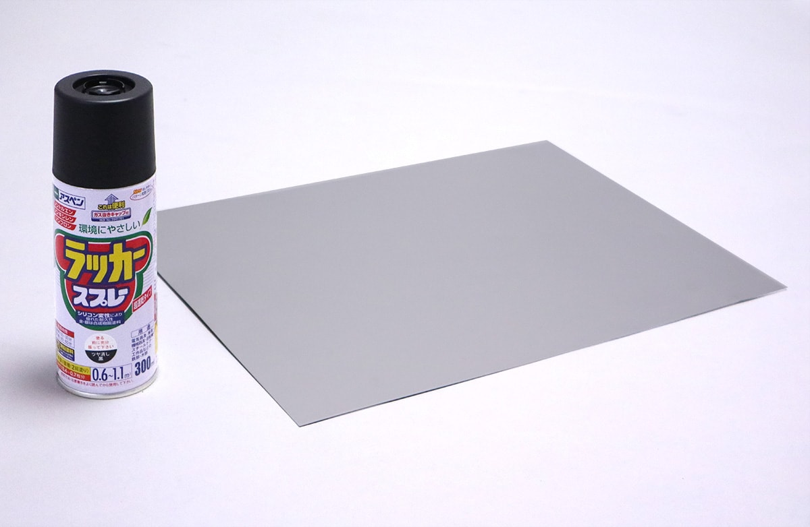
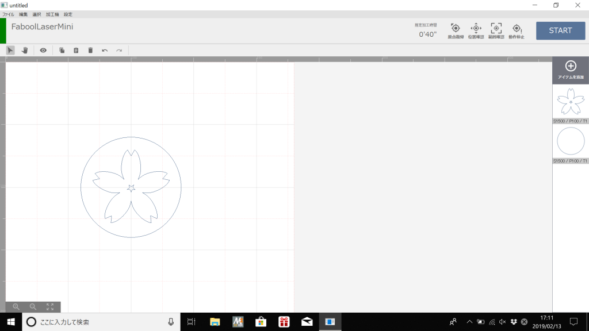
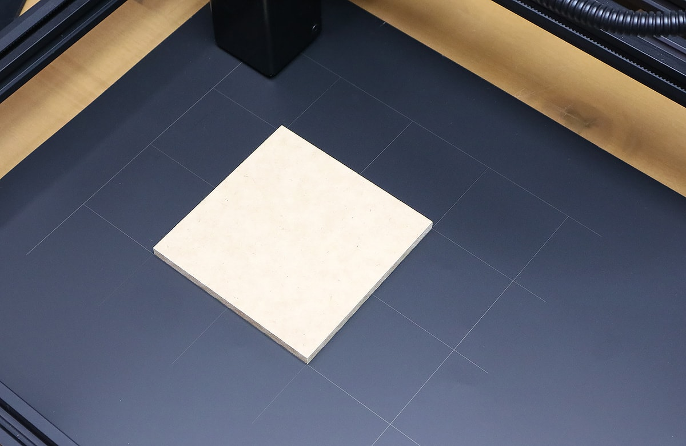
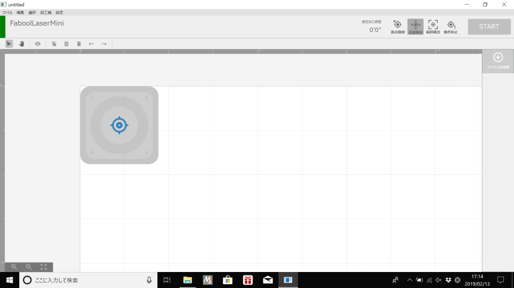
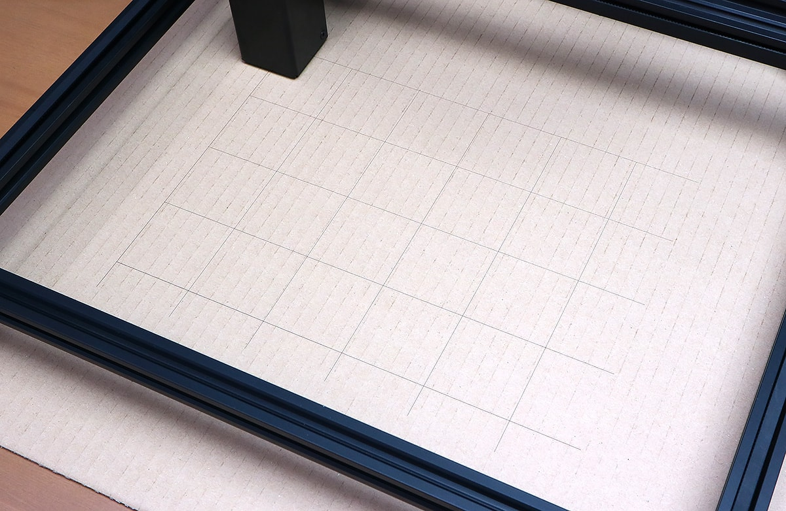

# 概要
DesktopApp は FABOOL Laserシリーズ対応の加工用ソフトウェアです。
画像データを取り込んでレイアウトを編集し、レーザパラメータを設定して加工を行うソフトウェアです。

---

<p align="center">

</p>

## 製品仕様
### 対応製品
FABOOL Laser Mini / FABOOL Laser CO2 / FABOOL Laser DS

### 対応ファイル
png / jpg / bmp / gif / tif / svg / dxf

### ソフトウェアの動作要件
#### Windows
- OS Windows 7以降
- CPU Core i3 2.4Ghz以上
- RAM：4GB以上
- HDD：1GB以上の空き容量

#### macOS
- OS 10.11.6 El capitan以降
- CPU：Core M 1.1Ghz以上
- RAM：4GB以上
- HDD：1GB以上の空き容量

## ご注意
- 本マニュアルのスクリーンショット等は実際のソフトウェアの表示と異なる場合がございます。
- 内容に関しては予告無しに更新されることがあります。
- 本製品の運用を理由とする損失、逸失利益などの請求につきましては、いかなる責任も負いかねますのであらかじめご了承ください。
- Microsoft Windowsは、米国 Microsoft Corporation の米国およびその他の国における登録商標または商標です。
- Apple、App Store、Apple ロゴ、Mac、Mac OS、OS X、macOS、iPad、iPhoto、iPod touch、および iTunes は、Apple Inc. の商標です。
- Adobe、Adobe Illustrator および Photoshop は、 Adobe Systems Incorporatedの米国およびその他の国における登録商標または商標です。

<div style="page-break-before:always"></div>

# インストール
ここでは、DesktopAppのインストール方法について説明します。

なお、旧ソフトウェアのドライバ（smartLaserドライバ/faboolLaserドライバ）がインストールされている場合は、本ソフトウェアのインストール時に自動的に削除されます。予めご了承下さい。

## ソフトウェアのインストール

1. こちらのご案内ページに記載されている同意事項をご確認いただき、お使いのOSのインストーラをダウンロードしてください。

2. ダウンロードしたインストーラを実行します。
3. Windowsをお使いの方でセキュリティ警告（SmartScreen）が表示される場合は、「詳細情報」をクリックし、発行元が「SMARTDIYS CO., Ltd.」であることを確認して「実行」ボタンを押してください。
<p align="center">

</p>
<p align="center">

</p>

---
4. インストール画面が表示されるので、「次へ」ボタンをクリックします。
<p align="center">

</p>

---
5. DesktopAppが既にインストールされているか確認します。既にインストールされている場合はアンインストールされます。
<p align="center">

</p>

---
6. チェックが完了したら、「次へ」ボタンをクリックします。
<p align="center">

</p>

---
7. インストール先フォルダを指定します。特に変更がなければそのまま「次へ」ボタンをクリックします。
<p align="center">

</p>

---
8. FABOOLSoftwareドライバのインストール状況を確認します。インストールされている場合はアンインストールされます。※PC環境によっては少し時間がかかる場合があります。
<p align="center">

</p>
<p align="center">

</p>

---
9. チェックが完了したら、「次へ」ボタンをクリックします。
<p align="center">

</p>

---
10. インストールするコンポーネントが表示されます。全てにチェックが入っていることを確認し、「次へ」ボタンをクリックします。
<p align="center">

</p>

---
11. 表示されるライセンス条項をご確認頂き、同意される場合は「ライセンスに同意する」にチェックを入れ、「次へ」ボタンをクリックします。※ライセンスに同意されない場合はインストールを完了することはできません。
<p align="center">

</p>

---
12. インストールボタンをクリックすると、インストールが始まります。
<p align="center">

</p>
<p align="center">

</p>

---
13. Windowsをお使いの場合、インストール中にデバイスドライバのインストールが開始されますので、「次へ」をクリックしてインストールを行います。
<p align="center">

</p>

---
14. デバイスドライバのインストールが完了したら、「完了」ボタンをクリックします。
<p align="center">

</p>

---
15. インストール完了画面が表示されるので、「完了」ボタンをクリックします。このとき「Run Application」にチェックが入っている場合は、自動的にDesktopAppが起動します。
<p align="center">

</p>

## PCの設定について
DesktopAppは加工中、加工機に対して常に制御情報を送付しています。そのため、PCがスリープモードになってしまったり、アプリケーションが非アクティブになってしまうなどすると、加工機への制御情報の送付が中断されてしまったり、通信の優先度が下げられてしまう場合があります。
これを避けるため、下記を参考にスリープ設定を解除することをお勧めしております。

- [スリープ設定の解除方法（Windows 10）](https://www.tipsfound.com/windows10/03005)
- [スリープ設定の解除方法（Windows 7）](https://www.frontier-direct.jp/faq/09/004235.htm)
- [スリープ設定の解除方法（Mac）](http://minto.tech/mac-sleep/)

<div style="page-break-before:always"></div>

# 各部名称
## ソフトウェア画面
本ソフトウェアの基本ウィンドウで、以下の要素から構成されています。

<p align="center">

</p>

#### (A) タイトルバー
現在のプロジェクトファイルの名称や、最小・最大化ボタン、ソフトウェアの終了ボタンが配置されています。

#### (B) メニューバ
メニューを選択することにより、様々な機能を実行させます。

#### (C) 加工機コントロールエリア
加工機との接続状態やエラー内容が表示されます。また、加工機のコントロールは主にここから行います。

#### (D) ツールバー
グラフィックエリアのコントロールツールが表示されています。

#### (E) プロパティパレット
グラフィックエリアで選択しているアイテムの位置情報などが表示されます。

#### (F) グラフィックエリア
加工データのレイアウトを行うことができます。

#### (G) アイテムリスト
加工データを追加したり、加工データの一覧が表示されています。

#### (H) パラメータ設定ウィンドウ
アイテムリストに表示されているアイテムをクリックすると表示され、対象のアイテムの加工パラメータを設定します。


## メニューバー
### ファイル
- 新しいプロジェクト: 新規プロジェクトを作成します。
- プロジェクトを開く: 保存されているプロジェクトを開きます。
- プロジェクトを保存: 現在開いているプロジェクトを保存します。
- プロジェクトを別名で保存: 現在開いているプロジェクトを別名で保存します。

### 編集
- 元に戻す: プロジェクトの編集状態を1つ前の状態に戻します。
- やり直す: プロジェクトの編集状態を1つ後の状態に進めます。
- コピー: 選択しているグラフィックオブジェクトをペーストバッファにコピーします。
- ペースト: コピーしたグラフィックオブジェクトを貼り付けます。
- 削除: 選択しているアイテムを削除します。

### 選択
- 全て選択: グラフィックオブジェクトを全て選択します。

### 加工機
- 動作停止: 加工機の動作を停止させます。
- 原点復帰: 加工機に原点復帰指示を送ります。
- グリッドアイテムの作成: グラフィックエリアに表示されているグリッドを加工アイテムとして作成します。

### ユーザ辞書
- ユーザ辞書マネージャー: ユーザ辞書マネージャーを開きます。ユーザ辞書の編集やインポート・エクスポート等を行うことができます。

### 設定
- ユーザ設定: 各種設定を行うことができます。

### ヘルプ
- SmartDIYs Creatorについて: ソフトウェアのバージョン情報を確認できます。
- マニュアル: このマニュアルをブラウザで開きます。

## 加工機コントロールエリア

<p align="center">

</p>

ここでは、加工機に関する情報や加工機への動作命令を行うことができます。
加工機との接続状態は「接続済み」「未接続」で表示されます。また、エラーがある場合はエラー内容も表示されます。

- 推定加工時間: 現在のプロジェクトのおおよその加工時間を `時間 : 分 ' 秒 ''` で表示します。
- 原点復帰: 加工機がレーザヘッドの原点位置を確認し、ヘッド位置の誤差を解消します。
- 位置確認: 位置確認モードへの切り替えを行います。このモードではグラフィックエリアにレーザヘッドのアイコンが表示され、オブジェクトの実際の加工位置を確認できます。位置確認モードを解除する場合はこのアイコンをもう一度クリックします。
- 範囲確認: 加工機のレーザヘッドが加工範囲を示します。
- 動作停止: 加工機の動作を停止させます。
- START: ボタンを押すと確認ダイアログが表示され、加工を開始します。


## ツールバー

<p align="center">

</p>

- (1) 選択ツール: グラフィックエリア内のグラフィックオブジェクトをクリックすることで選択することができます。
- (2) パンツール: グラフィックエリアをドラッグすることで表示範囲の変更をすることができます。
- (3) ズームツール: グラフィックエリアをクリックすることで表示範囲を拡大することができます。また、Altキーを押しながらクリックすることで表示範囲を縮小することができます。ドラッグ操作では自由に拡大率変更を行うことができます。
- (4) プレビュー: 加工指示データを作成し、生成された加工指示データを可視化したものを表示します。
- (5) コピー: 選択しているグラフィックオブジェクトをペーストバッファにコピーします。
- (6) ペースト: コピーしたグラフィックオブジェクトを貼り付けます。
- (7) 削除: 選択しているアイテムを削除します。
- (8) 元に戻す: プロジェクトの編集状態を1つ前の状態に戻します。
- (9) やり直す: プロジェクトの編集状態を1つ後の状態に進めます。

## プロパティパレット
### グラフィックオブジェクト選択時

<p align="center">

</p>

通常時は、グラフィックエリア内のグラフィックオブジェクトの座標情報等を表示、編集することができます。

- X: グラフィックオブジェクトのX座標を表示しています。この数値を変更することで座標を指定することができます。
- Y: グラフィックオブジェクトのY座標を表示しています。この数値を変更することで座標を指定することができます。
- W: グラフィックオブジェクトの幅を表示しています。この数値を変更することで幅を指定することができます。
- H: グラフィックオブジェクトの高さを表示しています。この数値を変更することで高さを指定することができます。
- 縦横非を固定: このモードでは、上記の操作で幅/高さを指定した際に、縦横非を固定するために高さ/幅が自動的に設定されます。このボタンクリックすることでモードの解除/設定を行うことができます。
- Rotate: グラフィックオブジェクトの回転を表示しています。この数値を変更することで回転を指定することができます。

### 位置確認モード時

<p align="center">

</p>


位置確認モード時は、レーザヘッドの座標を表示、指定することができます。

- X: レーザヘッドのX座標を表示しています。この数値を変更することで座標位置に移動させることができます。
- Y: レーザヘッドのY座標を表示しています。この数値を変更することで座標位置に移動させることができます。
- ユーザ原点の設定: 現在の座標をユーザ原点として設定することができます。

## グラフィックエリア
加工データのレイアウトを行うためのエリアです。
- キャンバス: 加工機の加工範囲を表しています。加工範囲はユーザ設定で設定することができます。
- 拡大縮小ツール: グラフィックエリアの表示範囲を操作することができます。

## アイテムリスト
- アイテムを追加: クリックすることでメニューが表示され、プロジェクトにアイテムを追加することができます。
 - ファイル選択: ローカルファイルを追加します。
 - アセットカタログ: 本ソフトウェアに用意されている図形などを追加します。
 - テキスト作成: テキストオブジェクトを作成・追加します。

追加されたアイテムはリストから確認することができます。なお、このリストの並び順に加工が行われます。

また、アイテムリスト下部のアイコンをクリックすると表示モードを切り替えることができます。
<p align="center">

</p>

#### パラメータ設定ウィンドウ
アイテムリストに表示されているアイテムをクリックすると表示され、対象のアイテムの加工パラメータを設定します。

- マニュアル: アイテムの加工の有効・無効やパラメータを手動で設定できます。また、設定したパラメータをユーザ辞書へ登録できます。
- ユーザ辞書: 登録したパラメータを選択できます。
- プリセット: 弊社で推定した加工パラメータです（加工結果は実際に加工する素材の特性や機械の調整精度に依存します）

<div style="page-break-before:always"></div>

# 加工の種類とデータ
ここではFABOOLシリーズにおけるレーザ加工の種類と、対応する画像フォーマットについて説明します。

## ベクタ（線）加工

<p align="center">

</p>

この加工方法では、ベクタ画像のパスに沿ってレーザヘッドが移動し、加工を行うことができます。

### 特徴
- 切断加工や直線・曲線の刻印に適している加工方法です。
- この加工を行うためには、ベクタ画像（SVGやDXF）が必要です。

### データ作成方法
お持ちのドローイングソフトウェアにて任意の図形を描き、線の色を設定することでベクタ（線）加工を行うためのデータが作成できます。  
また、SVGデータをソフトウェアにインポートする際、色ごと別々のアイテムに分割されます。そのため、あらかじめ線の色分けを行なっておくことで、加工順序の変更を調整できるようになります。
```
※白色の線は無視されるため、白色以外で指定してください。
```
<p align="center">

</p>


----------------------------------

## ベクタ（塗り）加工

<p align="center">

</p>

この加工方法では、パスの「塗り」を細かい平行線を引き重ねて（ハッチング）表現します。本ソフトウェアでは平行線同士の間隔やパターンを設定することができます。

### 特徴
- ロゴや文字の刻印に適している加工方法です。
- この加工を行うためには、ベクタ画像（SVG）が必要です。

### データ作成方法
お持ちのドローイングソフトウェアにて任意の図形を描き、塗りの色を設定することでベクタ（塗り）加工を行うためのデータが作成できます。
また、SVGデータをソフトウェアにインポートする際、色ごと別々のアイテムに分割されます。そのため、あらかじめ線塗りの色分けを行なっておくことで、加工順序の変更を調整できるようになります。
```
※白色の塗りは無視されるため、白色以外で指定してください。
```
<p align="center">

</p>

```
[ご注意]
JPGやPNGなどをSVGとして保存してもベクタ画像には変換されません。
ベクタデータに変換するためには、お持ちのドローイングソフトウェアにて画像トレース等の作業が必要です。
```
----------------------------------

## ラスタ加工

<p align="center">

</p>

この加工方法では、ラスタ画像にディザリング処理を行って画像の濃淡を表現します。

### 特徴
- 濃淡のあるイラストや写真の刻印に適している加工方法です。
- この加工を行うためには、ラスタ画像（JPGやPNG等）が必要です。
- レーザの強度（刻印の濃さ）ではなく、ドットの密度で濃淡を表現します。

### データ作成方法
お持ちのペイントソフトウェア等にてトリミングやコントラストの調整を行ってください。

```
※インポート時にグレースケールへ自動変換変換されます。
※インポート時に横1023ピクセルにリサイズされます。
```

<p align="center">

</p>


----------------------------------
## DXFデータについて

### 書き出し形式について
本ソフトウェアでは、**DXF R12・テキスト** 形式の書き出しを推奨しております。

### 色分けについて
AutoCAD 2018 や LibreCAD をお使いの場合、レイヤーに色をつけて保存することで色分けを表現できます。

一方、DXFフォーマットはソフトウェア毎の方言が多く、お使いのソフトウェアによっては上記の方法で書き出した場合でも色を認識できない場合がございます。
その場合は、SVGとして書き出して頂くか、SVG変換を行うためのソフトウェアやオンラインサービスをご利用ください。

- [https://www.dxfconverter.org/](https://www.dxfconverter.org/)
- [https://convertio.co/ja/dxf-svg/](https://convertio.co/ja/dxf-svg/)
- [https://onlineconvertfree.com/ja/convert-format/dxf-to-svg/](https://onlineconvertfree.com/ja/convert-format/dxf-to-svg/)

<div style="page-break-before:always"></div>

# グラフィックエリアの操作
# グラフィックエリアのコントロール

## 表示エリアのコントロール
キャンバスエリアの表示領域は、`パンツール`や`ズームツール`で操作できます。
また、下記の操作方法でもコントロールすることができます。

- 表示領域の位置変更: スペースキー + マウスドラッグ
- 表示領域の縮尺変更: Altキー + マウスホイール

## グラフィックオブジェクトのコントロール
オブジェクトをクリックするとオブジェクトが選択され、コントローラが表示されます。
マウスドラッグ等でコントローラを操作することでオブジェクトをコントロールすることができます。
また、これらの操作は、プロパティパレットから行うこともできます。

### 位置のコントロール
コントローラをドラッグすることで任意の位置にオブジェクトを移動させることができます。
また、キーボードの矢印キーで移動させることもできます。

### 大きさのコントロール
コントローラの隅にあるグリップをドラッグすることで任意の大きさにすることができます。
ドラッグの際、`Shift`キーを押すと縦横比の固定を切り替えることができます。

### 回転のコントロール
コントローラのグリップ付近にマウスカーソルを近ずけると、カーソルのアイコンが回転コントロールのマークになります。この状態でドラッグすると任意の角度に回転させることができます。

### オブジェクトの複製
オブジェクトを選択した状態でコピーアイコンをクリックするとペーストバッファにコピーすることができます。この状態でペーストアイコンをクリックすると、オブジェクトを複製することができます。この際、オブジェクトに紐づいているレーザパラメータはコピー元のオブジェクトと共有されます。

### オブジェクトの削除
オブジェクトを選択した状態でゴミ箱アイコンをクリックすると削除することができます。

### オフジェクトの整列
オブジェクトを選択した状態で右クリックすると、メニューが表示されます。
このメニューの「整列」項目から任意の整列操作を行うことができます。

- `選択オブジェクトに整列`  
複数のオブジェクトが選択されている場合に有効です。
選択されている複数のオブジェクトの矩形範囲に於いて整列動作を行います。
複数のオブジェクトを選択して「右揃え」を行うと、一番右にあるオブジェクトの右端に整列されます。

- `キャンバスに整列`  
単体または複数のオブジェクトが選択されている場合に有効です。
キャンバスの範囲が整列の範囲に於いて整列動作を行います。
複数オブジェクトを選択して「右揃え」を行うと、キャンバスの右端に整列されます。

### オフジェクトの反転
オブジェクトを選択した状態で右クリックすると、メニューが表示されます。
このメニューの「変形」項目から任意の反転操作を行うことができます。

### オブジェクトの重なりの操作
オブジェクトを選択した状態で右クリックすると、メニューが表示されます。
このメニューの「背面へ移動」をクリックすると、選択オブジェクトを背面へ移動することができます。

<div style="page-break-before:always"></div>

# パラメータ設定
ここでは、パラメータの設定項目について説明します。

<p align="center">

</p>

## 有効
対象のアイテムを加工するかどうかを設定できます。「有効」のチェックが外れている場合、対象のアイテムは加工されません。  
```
※ 有効のチェックが外れているアイテムのグラフィックオブジェクトは、クリックによる選択操作が無効になります。
※ 無効オブジェクトを含むグループは選択することができます。また、「全て選択」で選択することもできます。
```

## スピード
加工中（レーザ照射中）のレーザヘッドの移動速度を設定します。スピードを遅くすると、素材に与えるレーザーのエネルギーが大きくなります。
```
※ 50 - 8000 [mm/min] の範囲で設定することができます。
```

## パワー
レーザ照射の強度を設定します。パワーが大きいほど素材に与えるレーザのエネルギーが大きくなります。
```
※ 0 - 100 [%] の範囲で設定することができます。
```

## 回数
レーザ加工の回数を指定します。１度に大きなエネルギーを与えると素材に悪影響（溶けや焦げ）が出てしまう場合、小さいエネルギーで繰り返し加工することで加工結果の改善が期待できます。
```
※ 0 - 30 [回] の範囲で設定することができます。
```

## DPI
ラスタ加工で有効になるパラメータです。画像の濃淡を表現するための処理（ディザリング）を行う際の解像度を設定します。デフォルトでは254DPIが設定されており、これは0.1mm毎にレーザが照射される値となります。また、液晶ディスプレイ等とは異なり、DPIを上げてもレーザ照射の点の大きさ自体は変わりません。DPIを上げすぎると全体が焼かれ過ぎてしまいますので、ご注意下さい。

```
※ 72 - 600 [DPI] の範囲で設定することができます。
※ 下記の画像は全て同じ画像データ及び同じ加工サイズで刻印しております。
※ 素材の特性や加工時間効率などに応じて個別に設定頂けます。
```

FABOOL Laser Mini 3.5W でダンボールに刻印 / 使用画像 : 1023x778 ピクセル

<p align="center">

</p>


## ハッチング
ベクタ（塗り）画像を加工する場合に有効になるパラメータです。ハッチングとは、細かい平行線を引き重ねて面を表現する方法であり、レーザ加工で「塗りつぶし」を表現するために行われます。ハッチングパラメータでは、この平行線同士の間隔とハッチングのパターンを設定することができます。
```
※ 間隔は 0.05 - 3.0 [mm] の範囲で設定することができます。
※ パターンは横線（H: Horizontal）、縦線（V: Vertical）、格子（G: Grid）の３パターンが設定できます。
※ テキストの塗り加工も、ベクタ（塗り）加工として扱われます。
※ 実際のレーザ照射の線幅や素材の特性によって、加工結果の印象は異なります。
```

<p align="center">

</p>

<div style="page-break-before:always"></div>

# ユーザ設定
ここでは、ユーザ設定ダイアログの設定項目について説明します。

<p align="center">

</p>

## 加工機

<!-- <p align="center">

</p> -->

### 設定
お使いの加工機のモデル名とレーザタイプを設定します。この設定は、加工範囲やドライバパワー、プリセットパラメータに影響します。

### 加工範囲
お使いの加工機の加工範囲を設定します。上記のモデル名を選択すると自動的に設定されるため、通常は設定を変える必要はございません。拡張フレーム等を利用する場合に設定します。

### ドライバパワー
モータに流れる電流値を調整します。上記のモデル名を選択すると自動的に設定されるため、通常は変更する必要はありません。脱調が多発する場合、この値を調整することで改善できる場合があります。

---------------
## 単位・表示

<!-- <p align="center">

</p> -->

### 単位
グリッドの間隔やオブジェクトの矩形表示単位などを mm または inch に設定できます。

### 表示
グリッドの表示・非表示の切り替えができます。

### プレビュー
プレビュー時の線幅を指定します。実際のレーザ幅に設定することで仕上がりの印象に近づきます。

---------------
## シーク速度

<!-- <p align="center">

</p> -->

シーク速度：レーザヘッドがレーザを出力していない時の移動速度です。基本的にレーザ出力が終了した地点から、次のレーザ出力開始点までの移動速度になります。

### シーク速度
Defaultモード: シーク速度を指定した値に設定します。
Qualityモード シーク速度を加工速度に合わせます。
※ラスタ加工中やハッチング加工中（ベクタ塗り加工中）は、常にQualityモードに準ずる動作で行われます。

### シーク速度（メンテナンス時）
位置確認や範囲確認を行う際のレーザヘッドの移動速度を設定できます。


---------------
## 補正

<!-- <p align="center">

</p> -->

```
※これらの機能は補助的なものです。
ハードウェアの調整を十分に行なった上でご利用ください。
```

### 大きさ補正
図形をG-Codeに変換する際に各方向へ指定された割合だけ拡大・縮小します。オブジェクトが加工範囲の境界近くにある場合、加工中にリミットスイッチに接触してしまう恐れがあります。

### X軸傾き補正
加工機のX軸の傾きを補正するため、GCodeに変換される際にオブジェクトにシアーを適用します。オブジェクトが加工範囲の境界近くにある場合、加工中にリミットスイッチに接触してしまう恐れがあります。


<!-- ---------------
## パラメータ

<p align="center">

</p>

### パラメータ初期値
新しいアイテムをインポートする際に設定されるレーザパラメータのデフォルト値を設定します。すでに生成されているパラメータには影響しません。 -->

---------------
## その他

<!-- <p align="center">

</p> -->

### 通知
ソフトウェアアップデートの自動通知の有効・無効を設定します。新しいバージョンがある場合、ソフトウェア起動時にダイアログが表示されます。

<div style="page-break-before:always"></div>

# 使い方
ここでは、実際にソフトウェアを起動し、加工を行うまでの流れを説明します。

## ソフトウェアの起動
インストールしたソフトウェアを起動します。起動すると新規プロジェクトが展開されます。
初回起動時には、利用する加工機の種類とユーザ設定ダイアログで設定されている加工機の種類が一致していることを確認してください。

## 加工機との接続
加工機の電源を入れ、USBケーブルでPCと加工機と接続します。

## 加工データの配置

### データのインポート
まず、アイテムリストパネルにある「アイテム追加」ボタンをクリックし、下記のいずれかの手段で加工アイテムを追加します。

- `ローカルファイルからインポート`  
お持ちの画像データ（jpg/png/svg等）をインポートする場合は「ファイル選択」ボタンをクリックしてください。ファイル選択ダイアログが開き、対象のファイルを選択することでインポートできます。
また、グラフィックエリアに対象ファイルをドラッグ&ドロップすることでもインポートできます。

- `アセットカタログからインポート`  
ソフトウェアに用意されている図形やサンプルデータを利用する場合は「アセットカタログ」をクリックしてください。アセットカタログが開き、お好きなデータを選択してインポートすることができます。

- `テキストアイテムの作成`  
任意の文字の加工アイテムを作成する場合は「テキスト作成」ボタンをクリックしてください。お持ちのフォントでテキストアイテムを作成することができます。
また、加工方法は「塗りのみ」「線のみ」「塗りと線」から選択することができます。
※縦書きや改行には対応しておりません。

### レイアウト編集
アイテムを追加するとキャンバスにグラフィックオブジェクトが配置されます。
配置されたオブジェクトの位置や大きさ、回転角度を設定します。

### パラメータ設定
アイテムリストにある対象のアイテムをクリックするとパラメータ設定ウィンドウが表示されます。
下記のいずれかの方法でパラメータを設定します。

- `マニュアル`  
  アイテムの加工パラメータを手動で設定できます。また、設定したパラメータをユーザ辞書へ登録できます。

- `ユーザ辞書`  
  ユーザ辞書に登録されたパラメータを適用します。

- `プリセット`  
  あらかじめ用意されているパラメータです。加工結果は実際に加工する素材の特性や機械の調整精度に依存します。

### 加工順序設定
複数のアイテムを加工する場合、アイテムリストの上から順に加工されます。アイテムリストの順序はドラッグ&ドロップで並べ変えることができます。

<p align="center">

</p>

## 加工準備

### 原点復帰
まず最初に原点復帰ボタンを押して原点復帰を行ってください。
原点復帰を行うことで、加工機がレーザヘッドの位置を正確に把握することができます。

### 素材の設置
加工機に加工対象の素材を設置します。

### 焦点距離の設定
ソフトウェアの「位置確認モード」などを利用してレーザヘッドを素材の真上へ移動させ、素材とレーザヘッドの距離（焦点距離）を調整します。

<p align="center">

</p>

### 加工範囲の確認
必要に応じて、素材に対する加工範囲の確認を行ってください。
加工範囲の確認は「位置確認」や「範囲確認」をご利用ください。


## 加工開始

---------------

### 安全チェック項目
- レーザヘッドの高さは適切ですか？
- 加工エリア内や加工機の近くに障害物はありませんか？
- 素材を置いている台は燃えにくいですか？  
  （素材の厚さによってはレーザ光が到達する可能性があります）
- 加工範囲が配置している素材の中に収まっていますか？

---------------


全ての準備が整ったら、STARTボタンをクリックします。注意喚起ダイアログが表示されるので内容を確認し、「OK」ボタンを押してください。

パラメータの設定値や素材によっては炎が上がる恐れがあります。加工中は加工機から離れないでください。
また、ソフトウェアは加工中、加工機に対して常に制御情報を送付しています。そのため、PCがスリープモードになってしまったり、アプリケーションが非アクティブになってしまうなどすると、加工機への制御情報の送付が中断されてしまったり、通信の優先度が下げられてしまう場合があります。ご注意ください。

## 加工終了
加工機から素材を取り出し、加工結果を確認してください。

## 作業終了

全ての作業が終了したら、下記の手順で終了します。
1. 加工機とPCを接続しているUSBケーブルを外し、加工機の電源を落とします。
2. 必要に応じてプロジェクトを保存してください。現在の加工データやパラメータの情報がプロジェクトとして保存することができます。
3. ソフトウェアのメインウィンドウを閉じ、ソフトウェアを終了します。

<div style="page-break-before:always"></div>

# グリッドアイテムの活用
メニューバーにある「加工機 > グリッドアイテムの作成」をクリックすると、キャンバスのグリッドを加工データとして作成することができます。このグリッドを任意の土台に刻印することで、位置合わせをサポートします。

```
※ 可燃性のある素材にグリッドを刻印して運用する際は十分注意してください。
```


|  |  |
|:-------------------------------------------------------------|:-----------------------------------------------------|
| 金属板 + ラッカー塗装                                        | ダンボール                                           |


## グリッドアイテムの刻印

<p align="center">

</p>


1. グリッドを刻印する素材（以下「土台」）に刻印を行う前に、土台と加工機の位置を固定します（土台と加工機の位置関係がずれると位置决め精度が低下します）。
2. ソフトウェア上で「加工機 > グリッドアイテムの作成」をクリックし、任意の大きさのグリッドを作成します。
3. パラメータを設定して加工を行います。主線（黒い線）と副線（赤い線）がありますが、主線のみでも大丈夫です。

## グリッドを利用した位置決め
|  |  |
|:-------------------------------------------------|:-----------------------------------------|
| キャンバス上のオブジェクトの位置                 | 加工する素材の位置                       |

<p align="center">

</p>


## 土台と加工機の相対位置がずれてしまった場合
土台のグリッドと加工機の相対位置がずれてしまった場合は、ソフトウェア上の「位置確認」機能を利用して、ある程度復旧させることができます。

1. 「位置確認」ボタンを押してレーザヘッドを任意の位置へ移動させます（下記の例ではヘッドの左上を原点に合わせています）。
2. 実際のレーザヘッドの位置とグリッドの位置関係を確認し、ソフトウェア上の位置関係と同じになるように修正します。
3. 1,2の作業をいくつかのポイントで行い、土台と加工機の相対位置を修正します。

|  |  |
|:------------------------------------------------------|:----------------------------------------------|
| キャンバス上のレーザヘッドとグリッドの位置関係        | 実際のレーザヘッドとグリッドの位置関係        |


## 参考
FABOOL Laser Mini 1.6W

|  |  |
|:------------------------------------------------------|:----------------------------------------------|
| 金属板 + ラッカー塗装                                 | ダンボール                                    |
| S300 / P100 / T2                                      | S2000 / P100 / T1                             |

<div style="page-break-before:always"></div>

# ユーザ原点の利用方法
ここでは、ユーザ原点の設定方法について説明します。

## ユーザ原点の設定の概要

ユーザ原点の設定を行うと、通常リミットスイッチ付近に設定されている原点をユーザの任意の座標に設定することができます。
この設定を行うと、加工開始時に機械原点への原点復帰を行いません。

### この機能のご利用シーン
- 平皿やお盆など、素材の縁に高さがあり、原点復帰を行うとぶつかってしまう場合
- 位置合わせなどの理由で、加工開始時に原点復帰を行いたくない場合

### この機能を利用する上での注意事項
- 原点復帰は加工機がレーザヘッドの位置を正確に知るために必要な動作です。
- ユーザ原点モードでは機械原点への原点復帰が行われないため、レーザヘッドの位置に誤差が蓄積されていく可能性があります。**※軸滑りや引っかかり等、機械の調整状態に依存します**。
- 誤差が大きくなった場合、リミットスイッチなどに接触し、**加工が停止する恐れ** があります。
- 軸ズレが発生した場合はこのモードを解除し、原点復帰を行なって下さい。

## ユーザ原点の設定方法

- 原点復帰を行います。
- 位置確認ボタンをクリックし、位置確認モードに切り替えます。
- 任意の位置にレーザヘッドを移動するか、数値を入力します。
- 「ユーザ原点の設定」ボタンをクリックします。

<p align="center">

</p>

## ユーザ原点の解除方法
- 位置確認ボタンをクリックし、位置確認モードに切り替えます。
- 「ユーザ原点の解除」ボタンをクリックします。

<p align="center">

</p>

<div style="page-break-before:always"></div>

# ユーザ辞書
ここでは、ユーザ辞書の活用方法について説明します。

<p align="center">

</p>

## ユーザ辞書の活用

よく使うパラメータをユーザ辞書へ登録しておくとパラメータ設定が簡単になります。
また、登録後の編集やインポート・エクスポート機能も備えています。

### ユーザ辞書への登録

ユーザ辞書への登録は下記の手順で行います。
1. パラメータ設定ウィンドウの「マニュアル」タブを開きます。
2. 任意のパラメータを設定します。すでに設定済みの場合はスキップしてください。
3. 「辞書へ登録」ボタンをクリックすると、パラメータ編集ダイアログが表示されます。
4. パラメータの名称と、必要に応じて説明文を入力します。
5. OKボタンを押すと、ユーザ辞書に登録されます。

### ユーザ辞書の利用
ユーザ辞書を利用するには、下記の操作を行います。
1. パラメータ設定ウィンドウの「ユーザ辞書」タブを開きます。
2. 任意のパラメータをクリックし、パラメータの設定値を確認します。
3. 適用ボタンをクリックします。

### ユーザ辞書に登録されたパラメータの編集
1. パラメータ設定ウィンドウの「ユーザ辞書」タブを開きます。
2. 対象のパラメータをダブルクリックすると、パラメータ編集ダイアログが表示されます。
3. 各設定値に任意の値を入力します。
4. OKボタンを押すと、パラメータの編集が完了します。


## ユーザ辞書マネージャ

<p align="center">

</p>


メニューバーの [パラメータ] > [ユーザ辞書マネージャー] を選択すると、ユーザ辞書マネージャーダイアログが表示されます。
ここでは、ユーザ辞書のインポートやエクスポート、一括削除の操作が行えます。

### ユーザ辞書のエクスポート
1. エクスポートボタンを押してエクスポートダイアログを表示します。
2. 表示されているリストからエクスポートするパラメータにチェックを入れます。
3. OKボタンを押して、保存場所および保存ファイル名を指定します。

### ユーザ辞書のインポート
1. インポートボタンを押してファイル選択ダイアログを表示します。
2. インポートしたいユーザ辞書ファイルを選択すると、インポートダイアログが表示されます。
3. インポートしたいパラメータを選択して、OKボタンを押します。

### パラメータの一括削除
1. 表示されているリストから削除したいパラメータにチェックを入れます。
2. ゴミ箱アイコンをクリックし、削除を行います。

```
※削除されたアイテムは復元できません。事前にエクスポート等でバックアップを作成することをお勧めいたします。
```

<div style="page-break-before:always"></div>

# 補正値の算出方法
ここでは、ユーザ設定の「補正」項目について説明します。
この補正項目は下記の現象を改善するために有効な調整値です。

- 加工物の寸法がデータと異なる
- X軸とY軸が直角ではない

## 加工物の寸法がデータと異なる

### 主な原因
1. 光軸調整が適切ではない
2. プーリーやタイミングベルトなどの調整が適切ではない

上記の調整を行なっても改善しきれない場合は、大きさ補正の項目を設定して頂くことで改善が期待できます。

### 補正値の算出方法

1. 任意の幅・高さの矩形の加工データを用意します。
2. シワや歪みが生じにくい素材に刻印加工を行います。
3. データのサイズと刻印加工のサイズから比率を算出します。

#### [算出例]
データのサイズ: H:200.00mm x W:200.00mm  
実際の加工サイズ: H:199.10mm x W:199.50mm

[Hの補正値]

```
求め方: （データ）200.00 / （実際）199.10 = 1.00452034...
設定値: 100.45203(%)
```

[Wの補正値]

```
求め方: （データ）200.00 / （実際）199.50 = 1.00250626...
設定値: 100.25063(%)
```

## 直角のデータが正確ではない

### 主な原因

原因:
1. 光軸調整が適切ではない
2. フレームやX軸の組み立て時に傾きが生じている

上記の調整を行なっても改善しきれない場合は、傾き補正の項目を調整して頂くことで改善が期待できます。

### 補正値の算出方法

まず、上記の「大きさ補正」を済ませておくと、より正確に補正値が算出できます。

1. 任意の幅・高さの矩形の加工データを用意します。
2. シワのない紙などの素材を切断加工します。
3. 左下角と左上角が重なるように折り重ねます。
4. 右下角と右上角の重なりにズレがある場合、このズレの距離（L）を測ります。
5. 下記の公式に当てはめて、角度を算出します。  
`θ (deg) = arcsin ( (L/2) / W ) * 180 / π`

<p align="center">

</p>

#### [算出例]

データのサイズ: H:280.00mm x W:400.00mm  
折り重ねた際の右下角と右上角のズレ: L: 1.50mm

[角度の補正値]

```
求め方: arcsin( 0.75 / 400.00 ) * 180 / π
設定値:   
右上がりを補正する場合: -0.10743°  
右下がりを補正する場合: +0.10743°
```

<div style="page-break-before:always"></div>

# ソフトウェアのアップデート
ここでは、アップデート方法について説明します。

## ソフトウェアのアップデート

ソフトウェアのアップデートを行う際には、下記のサイトより最新版のインストーラをダウンロードし、インストールを行なってください。  
**※なお、インストールを行う際は起動している SmartDIYs Creator を必ず終了させてください。**

[SmartDIYs Creator ダウンロードページ](https://www.smartdiys.com/smartdiys-creator/)

最新版のインストールを行う場合、過去のバージョンのソフトウェアは自動的にアンインストールされますが、ユーザ設定やパラメータのユーザ辞書は保持されます。


## 現在のバージョンの確認
`メニューバー` > `ヘルプ` > `SmartDIYs Creator について` をクリックすると現在のソフトウェアバージョンを確認できます。

## アップデート通知
`メニューバー` > `ユーザ設定` > `その他` にある「アップデート通知を有効にする」にチェックを入れると、新しいバージョンがリリースされている場合にお知らせが表示されます。

<div style="page-break-before:always"></div>
